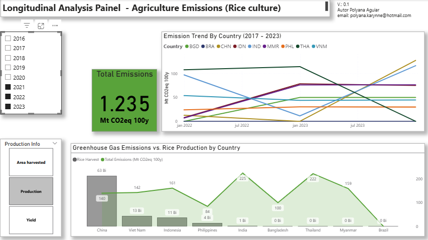

## 🌾 **Greenhouse Gas Emissions in Rice Cultivation: A Comparative Analysis with a Focus on Brazil**

### | **Objective**

This project presents an in-depth exploratory data analysis (EDA) of greenhouse gas emissions originating from rice cultivation, focusing on a selection of the world's top producers: **China (CHN), India (IND), Bangladesh (BGD), Indonesia (IDN), Vietnam (VNM), Thailand (THA), Myanmar (MMR), and the Philippines (PHL)**.

The core of the analysis is a comparative study, drawing a detailed parallel between the emission trajectories of these leading nations and **Brazil (BRA)**. The goal is to benchmark Brazil's performance, understand its position in the global context, and investigate the correlation between emission trends and documented agricultural practices.

co2e_100yr 

---
#### | **Data Sources**
The data used in this analysis were sourced from two primary, publicly available databases: the Food and Agriculture Organization of the United Nations (FAOSTAT) and the Climate TRACE coalition.

**Agricultural Production Data:** [FAOSTAT](https://www.fao.org/faostat/en/#data/QCL)

Statistics on agricultural production were obtained from the FAOSTAT database. Specifically, we utilized the "Crops and livestock products" dataset to gather time-series information on key metrics such as:

* Production Quantity: The total quantity harvested of rice (e.g., in tonnes).
* Yield: The productivity of rice per unit of land (e.g., in tonnes per hectare).
* Area Harvested : 
FAOSTAT serves as a comprehensive and standardized source for global agricultural data, making it ideal for cross-national and historical comparisons.

**Greenhouse Gas Emissions Data:** [Climate TRACE](https://climatetrace.org/data)

Greenhouse gas (GHG) emissions data were sourced from the Climate TRACE inventory. Climate TRACE provides a detailed and independently compiled inventory of global emissions, often with a high degree of granularity.

For this study, the database was used to identify and quantify emissions associated with rice cultivation, an agricultural activity,

Reference: Climate TRACE - Data Portal

By integrating these two sources, this analysis correlates agricultural output as reported by FAOSTAT with the associated emissions as inventoried by Climate TRACE, enabling a comprehensive view of the climate impact of agricultural activities.

---

#### | **Key Research Questions**

This analysis seeks to answer the following questions:

* **Emission Evolution:** How have GHG emissions from rice farming evolved over the years for each of the top-producing countries?
* **Brazil's Benchmark:** How does Brazil's emission trajectory compare to the other major producers? Is it following, leading, or lagging behind global trends?
* **Practices and Policies:** What correlations can be found between emission reduction trends and the documented agricultural policies or mitigation practices implemented in these nations?
* **Actionable Insights:** What successful strategies from other countries could potentially be applied in Brazil to reduce its emissions footprint from rice cultivation? What lessons can be learned from countries where emissions have not decreased?

---
#### | **Methodology**
The project was conducted using exploratory data analysis (EDA) techniques to clean, process, and visualize the dataset. The quantitative findings were supplemented with qualitative research into the agricultural policies and sustainability initiatives of the selected countries to provide context to the observed trends.

> | EDA (Exploratory Data Analysis)
Each dataset underwent separate preprocessing: the Climate Trace data was prepared using Python, and the FAOSTAT data was processed within Power BI. Both datasets were subsequently integrated into a Power BI model for comprehensive analysis. The preprocessing steps are detailed below.

> * **Greenhouse Gas Emission Data (Climate Trace)**:

> * **Agriculture Production Data (FAOSTAT)**:

---
#### | **Visualizations**

  

    
  

  

    
  

  

    
  

---

#### | **Key Fidings**

>

   

---

